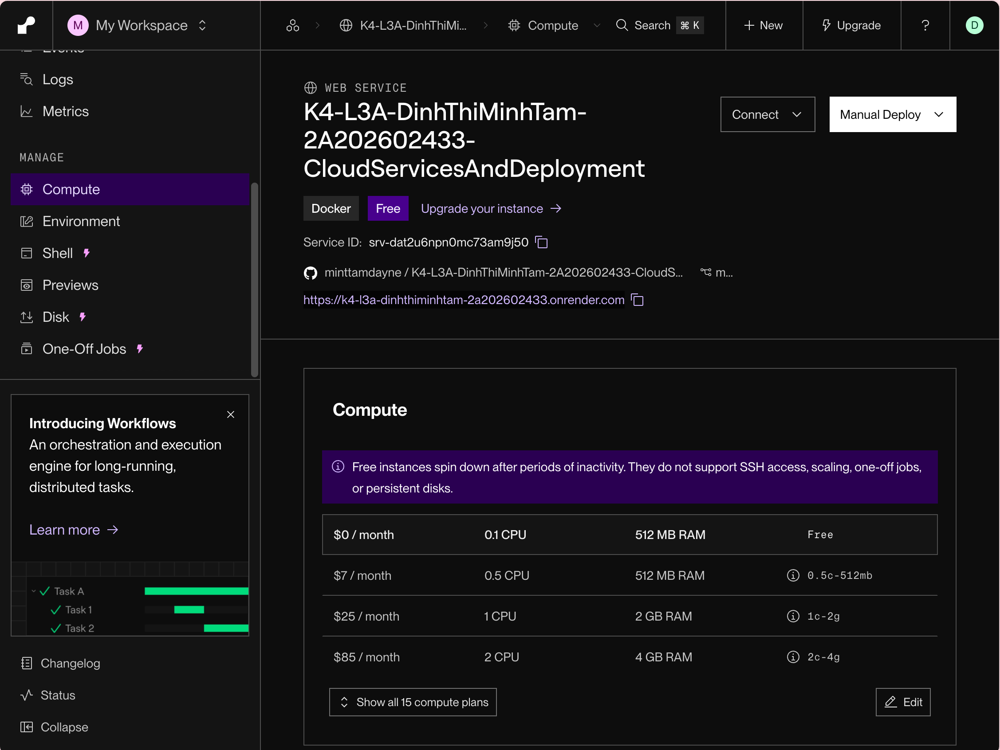
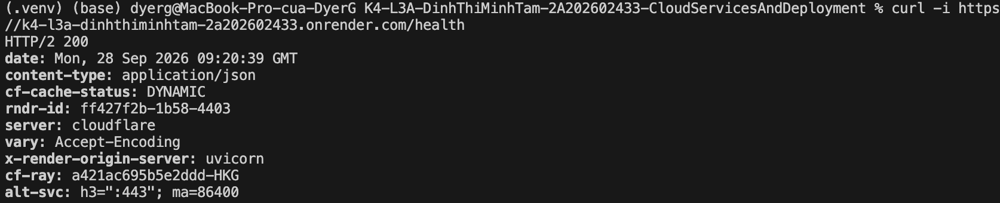
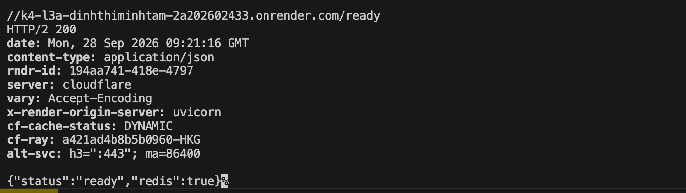
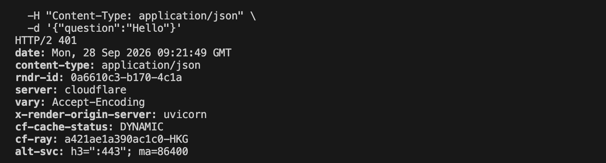

# Thông Tin Deploy — Checkpoint 5

> Điền file này sau khi deploy xong. `pytest tests/test_cp5.py` đọc file này
> để tìm địa chỉ service của bạn và gọi thử.
>
> **Chỉ ghi TÊN biến môi trường, tuyệt đối không dán giá trị API key vào đây.**
> Repo này công khai — dán khóa vào là mất khóa.

## Thông Tin Học Viên

| Mục | Nội dung |
|-----|----------|
| Họ và tên | Dinh Thi Minh Tam |
| Mã học viên | 2A202602433 |
| Repo | https://github.com/minttamdayne/K4-L3A-DinhThiMinhTam-2A202602433-CloudServicesAndDeployment |
## Service

| Mục | Nội dung |
|-----|----------|
| Public URL | https://k4-l3a-dinhthiminhtam-2a202602433.onrender.com |
| Platform | Render |
| Ngày deploy | 2026-09-28 |

## Biến Môi Trường Đã Set Trên Cloud

Ghi tên biến và **nguồn giá trị**, không ghi giá trị:

| Biến | Đã set | Ghi chú |
|------|--------|---------|
| `PORT` | ✅ | platform tự gán |
| `AGENT_API_KEY` | ✅ | đặt trong dashboard, không nằm trong repo |
| `REDIS_URL` | ✅ | cấu hình trên Render, không ghi giá trị |
| `RATE_LIMIT_PER_MINUTE` | ✅ | 10 |
| `MONTHLY_BUDGET_USD` | ✅ | 10.0 |
| `LOG_LEVEL` | ✅ | INFO |

## Lệnh Kiểm Tra

Public URL dùng để kiểm tra:

```bash
# 1. Liveness — mong đợi 200 {"status":"ok"}
curl -i https://k4-l3a-dinhthiminhtam-2a202602433.onrender.com/health

# 2. Readiness — mong đợi 200 {"status":"ready"} (đã nối được Redis)
curl -i https://k4-l3a-dinhthiminhtam-2a202602433.onrender.com/ready

# 3. Không có API key — mong đợi 401
curl -i -X POST https://k4-l3a-dinhthiminhtam-2a202602433.onrender.com/ask \
  -H "Content-Type: application/json" \
  -d '{"question":"Hello"}'

# 4. Có API key — mong đợi 200 kèm câu trả lời
curl -i -X POST https://k4-l3a-dinhthiminhtam-2a202602433.onrender.com/ask \
  -H "Content-Type: application/json" \
  -H "X-API-Key: $AGENT_API_KEY" \
  -H "X-User-Id: sv-test" \
  -d '{"question":"Deploy là gì?"}'

# 5. Rate limit — gọi 15 lần, những lần cuối phải trả 429
for i in $(seq 1 15); do
  curl -s -o /dev/null -w "%{http_code} " -X POST https://k4-l3a-dinhthiminhtam-2a202602433.onrender.com/ask \
    -H "Content-Type: application/json" \
    -H "X-API-Key: $AGENT_API_KEY" \
    -H "X-User-Id: sv-test" \
    -d '{"question":"test"}'
done; echo
```

## Kết Quả Chạy Thật

Kết quả kiểm tra thực tế:

```
Kiểm tra thực tế ngày 2026-09-28:

- `/health`: `HTTP/2 200`, `{"status":"ok","service":"day12-agent","version":"1.0.0"}`
- `/ready`: `HTTP/2 200`, `{"status":"ready","redis":true}`
- `/ask` không có `X-API-Key`: `HTTP/2 401`, `{"detail":"invalid or missing API key"}`
```

## Ảnh Chụp Màn Hình

Đặt ảnh trong thư mục `screenshots/`:

- `screenshots/dashboard.png` — trang quản lý service trên Render

- `screenshots/health.png` — kết quả gọi `/health`

- `screenshots/ready.png` — kết quả gọi `/ready`

- `screenshots/ask-401.png` — kết quả `/ask` thiếu API key


---

## Nếu Dùng Phương Án Dự Phòng

Không đăng ký được tài khoản cloud? Vẫn nộp được bài, nhưng CP5 tối đa 60% điểm:

1. Đặt `LOCAL_FALLBACK=true` trong `.env`
2. Chạy `docker compose up -d` rồi kiểm tra `docker compose ps`
3. Chụp màn hình vào `screenshots/`
4. Chạy `pytest tests/test_cp5.py -v` — bộ test sẽ tự chuyển sang kiểm tra
   `http://localhost:8000`
5. Ghi rõ lý do không deploy được vào phần dưới đây:

```
Đã triển khai trên Render; không sử dụng phương án dự phòng local.
```
